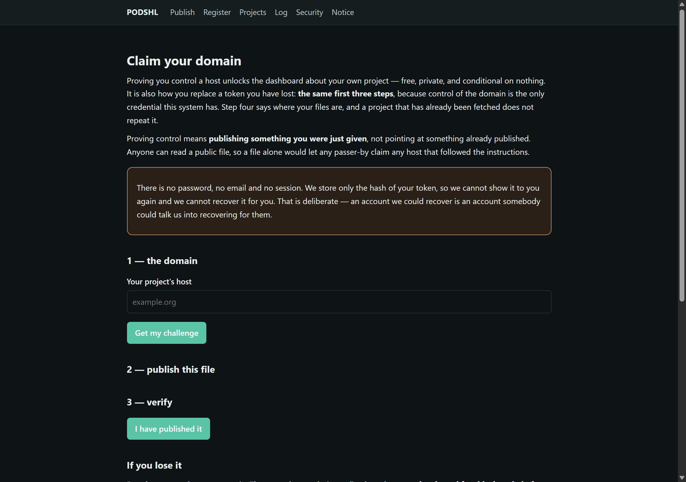
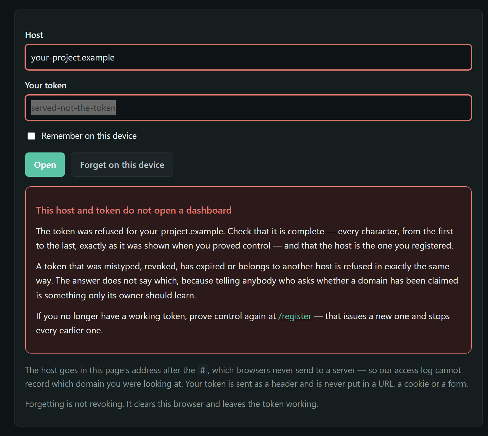
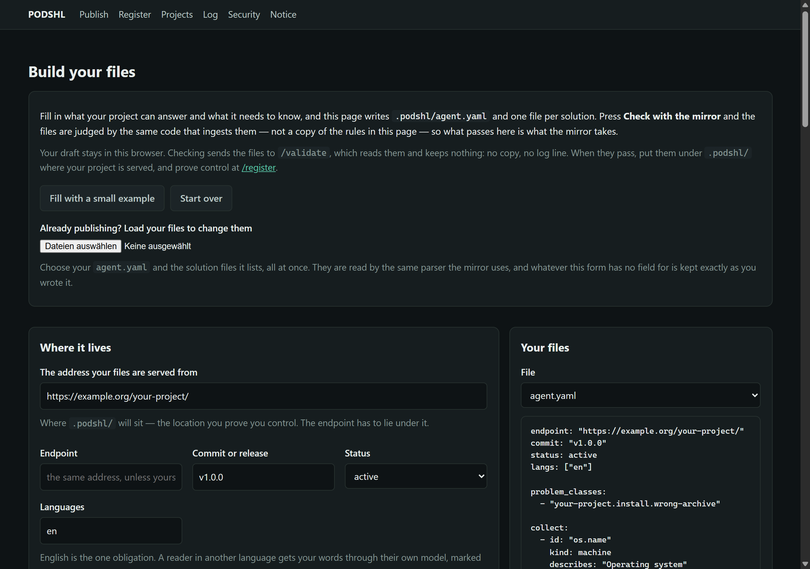
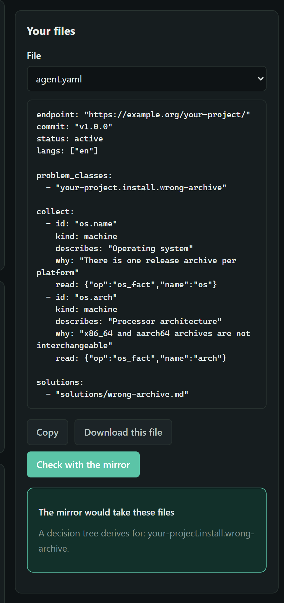
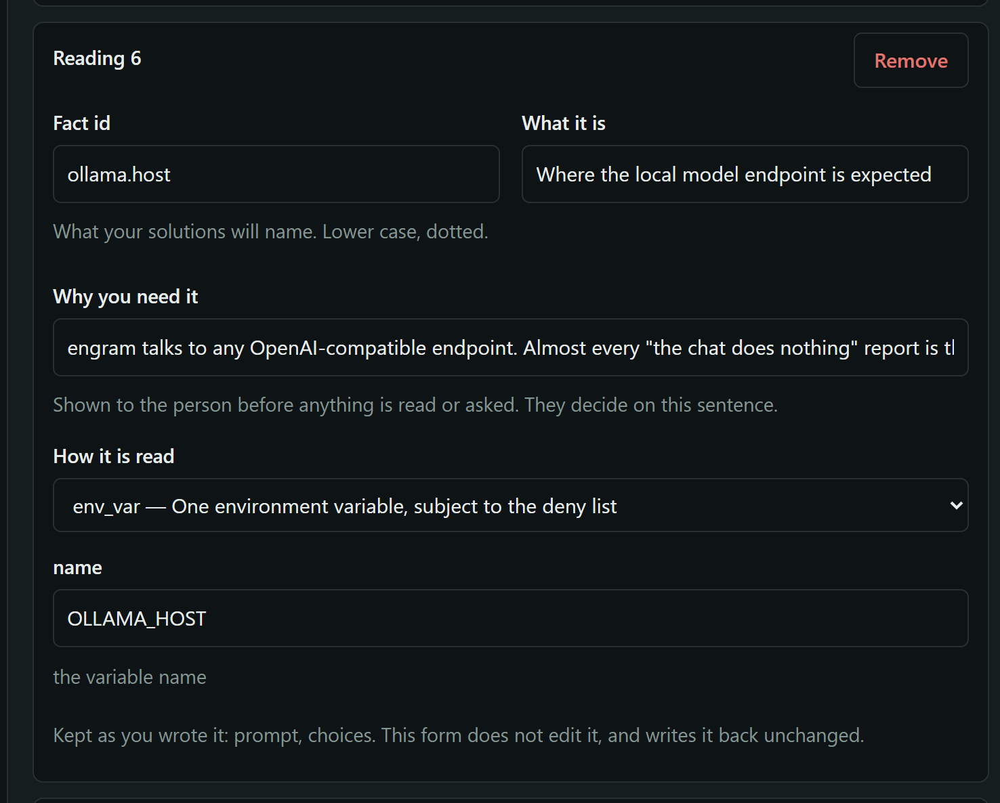
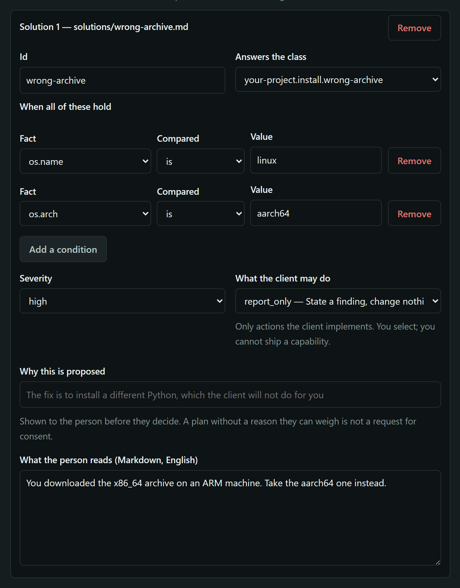
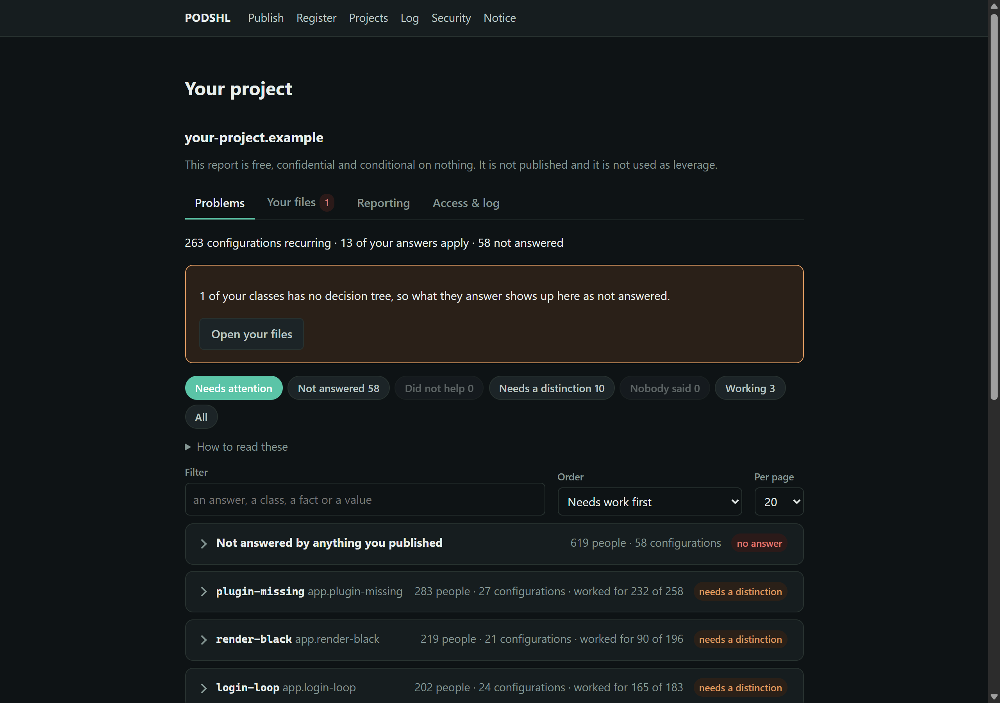
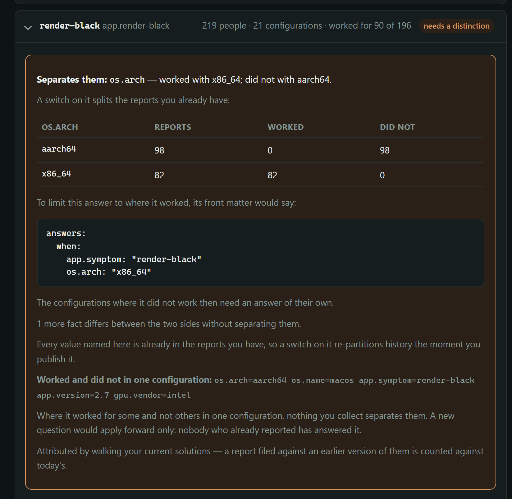
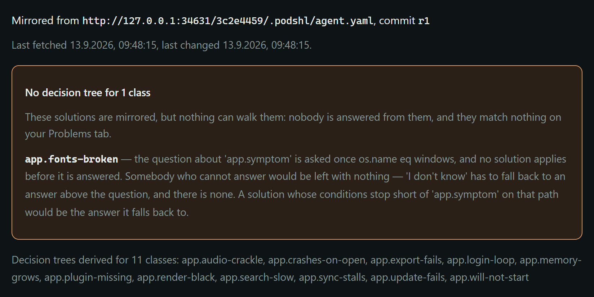

# Onboarding for open-source maintainers

Publish what you already know about your project's failures, and let a user's
own machine act on it — without you running a server, a model, or anything else
that costs money and attention you do not have.

**Three files, on a host you already control.** That is the entire ask.

    your-project/
      .well-known/
        podshl-challenge          the digest we give you, on one line
      .podshl/
        agent.yaml
        solutions/
          wheel-missing-for-python.md

A forge, a bare nginx and a static host all serve this identically: it is
fetched as plain HTTPS — the anchor is `https://<host>/`, and nothing is
fetched over plain HTTP — and there is no forge API involved.

> **Not yet true for a forge, and that is the honest state of it — 2026-09-14.**
> The challenge has to sit at the **root of a host you control**, and a
> repository on GitHub, GitLab or Codeberg does not give you one: nobody can
> write `https://github.com/.well-known/podshl-challenge`. Today that leaves a
> maintainer two ways in — a domain, or a user site such as
> `<you>.github.io`, which works but binds a project to a person and is not a
> path we would recommend to anybody else.
>
> Anchoring a repository directly is being built: the challenge file goes
> **into the repository**, and the anchor is your `owner/repo`. Note what it
> will and will not give you. It will not give you a **name** — "engram" is a
> word 1872 repositories on GitHub already use, and no mechanism here decides
> which of them is the real one, because none of them is. Your project appears
> as `you/your-project`, next to the others, and the person picking is the
> person who installed it and recognises where they got it. A domain, a
> distribution package or a registry entry, where you have one, weighs your row
> up — it is never what lets you in.

> **The short form.** Publish the three files above. The challenge file lives
> at `https://<host>/.well-known/podshl-challenge` and contains exactly the
> digest, nothing else, on a single line. Then four calls, which `/register`
> and `/dashboard` make for you:
>
>     POST /claim/<host>                         -> publish, proof
>     POST /claim/<host>/verify                  X-Podshl-Claim-Proof: <proof>   -> token
>     POST /claim/<host>/source  {"prefix": …}   X-Podshl-Claim: <token>
>     GET  /dashboard/<host>                     X-Podshl-Claim: <token>
>
> Put `publish` in the file and keep `proof`; verify; say where `.podshl/` is;
> read your dashboard.

## What it costs you

Nothing recurring. Specifically:

| | |
|---|---|
| A server | No. We mirror your files and serve from our copy |
| A model, or an inference bill | No. Your file is *matched*, never generated |
| A signing key | No. Control of the URL is the proof |
| A domain | No. Whatever host already serves your repository is enough |
| Answering support at 2am | No. The user's client does the reading and the acting |

The one thing you spend is the half hour it takes to write down the three
failures you are tired of explaining.

## Getting started

**[/register](/register)** walks you through it: enter your host, publish the
file where we tell you, press verify. You get a token, and that token *is* the
account — there is no password, no email and no session, and we store only its
hash. It is good for 365 days. The register page holds it only on the page and
offers to keep it; the dashboard page keeps it in your browser's `localStorage`
for that host, so closing the tab does not lose it and clearing site data does.

**Starting a claim holds the host for an hour.** If somebody started one for
your host within the last hour and has not verified, a second start answers
`409` and asks you to try again later. That protects a claim in progress from
being restarted under it; it grants the earlier caller nothing, because a claim
still needs the proof.

**A claim has two halves and only one of them is published.** You are given a
digest to put in the file, and its preimage to keep. Verification needs both. A
public file shows that *somebody* controls the host; it cannot show that the
person asking is that somebody, because anyone can read it — and on a forge,
anyone can read the repository it lives in. The half you keep is what makes the
claim yours rather than any passer-by's. It is shown once and we never publish
it.



Then **step four: say where your `.podshl/` is.** Proving control of a host does
not say where your files are, and until you say so nothing is fetched. The
default is the bare host; on shared hosting — a forge's pages, one project among
several — give the path instead, and nothing outside it is ever fetched.

**If you lose it, prove control again.** The same first three steps issue a new
token and stop every earlier one; a project already being fetched stays fetched.
Note that re-proving means publishing something you were just given, not
pointing at what is already there — which is exactly why it is proof. Anyone who can publish the challenge file already
controls the domain, which is the only credential this system has, so there is
nothing an account recovery could add except somebody to talk into it.

A token the dashboard does not accept is said as such, under the button — and it
does not say whether it was mistyped, revoked or expired, because telling anybody
who asks whether a domain has been claimed is for its owner alone:



**If you still have it and think it leaked**, revoke it from your dashboard.
That stops every token for the domain — including the one you are holding —
and then you re-prove. It has to revoke all of them, because they are
indistinguishable to you: each was shown exactly once.

**[/publish](/publish)** is what to write, with the worked example served as the
same bytes the specification ships. **[/security](/security)** is what the
client can and cannot do to somebody's machine.

## What you get

* **A diagnosis endpoint you do not have to run.** We serve correlation and
  answers from a mirror of your repository — and you do not author it either.
  The `answers.when` blocks you already wrote *are* the decision structure, so a
  project that published yesterday has a working diagnosis today with nothing
  new to learn. It answers one of four ways: here is the fix, I still need this
  fact, nothing here matches, or nothing is published for you. It never guesses
  at the nearest one.
* **A dashboard about your own project**, free, showing what recurs and what
  people actually tried. It is private to whoever controls the domain — there
  is no public ranking, ever, and no route that shows your figures to anyone
  else.
* **The solutions stay yours.** They live in your repository, so they survive us
  in every clone, they take pull requests from people who are not you, they are
  versioned alongside the code that needs them, and they get reviewed like code
  — which matters, because a solution proposes actions on other people's
  machines.
* **The report you would never otherwise get.** Today a user hits an install
  failure, gets nothing, and leaves. You never learn it happened. Once people use
  the client on your project, those failures start reaching your dashboard:
  which setups break, whether your answers worked, and what nothing you published
  covers yet — each sent only if that person agrees, and shown once five
  different people report the same thing.

## `agent.yaml`

This is abridged from the worked example that ships with the specification,
which is served live at `:8727` when the counterparty is running. Rather not
write it by hand? `/publish/build` on the operator's server builds this file and
the solutions from a form, and checks them with the code that ingests them.



**Check with the mirror** sends the files to the same code that ingests them,
and keeps nothing. What passes there is what the mirror takes:



**Already publishing?** Load your `agent.yaml` and solutions into the builder to
change them. Whatever the form has no field for is kept exactly as you wrote it,
and it says so — here engram's `ollama.host`, a reading that also asks a
question:



```yaml
endpoint: https://example.org/podshl/
commit: 4f2c1a9
status: active

# English is the one obligation. A user whose language is missing gets English
# rather than nothing, and their own client translates locally and says it did.
langs: [en, de]

# The classes you can answer. A class you did not publish cannot be matched,
# whatever model the user has — coverage comes from this list, not inference.
problem_classes:
  - pip.install.wheel-missing
  - pip.install.version-conflict
  - python.runtime.import-error

# What to read, and why. Every instruction here is checked against the client's
# published read vocabulary at ingest: an op or a tool that is not on that list
# is refused when this file arrives, not when a user has already agreed to it.
collect:
  - id: python.version
    kind: machine
    describes: Python version
    why: Wheels are published per Python minor version; most install failures are this
    read: { op: run_tool, tool: python3, args: ["--version"] }

  # A reading with a question attached. The reading is tried first; the question
  # is asked only if it comes back empty. One fact, written once, able to arrive
  # either way — and the report tells you which happened, so an outcome that
  # turned on an answer is not counted against a rule it never tested.
  #
  # **Attach `choices` whenever you attach a question.** A bounded answer may
  # travel to you; free text never does. Without them this fact simply never
  # reaches you.
  - id: pip.version
    kind: machine
    describes: pip version
    why: Resolver behaviour changed in 20.3 and again in 23.1
    read: { op: run_tool, tool: pip, args: ["--version"] }
    prompt: Which pip version does `pip --version` print?
    choices: ["20.x or older", "21.x or 22.x", "23.x or newer", "pip is not installed"]

  # Asked of a person only when the machine could not answer. Nobody should be
  # typing what a command could have read.
  - id: install.command
    kind: human
    describes: The exact command you ran
    why: pip, pipx, uv and poetry fail differently, and the message rarely says which
    prompt: Which command did you run?
    choices: [pip install, uv pip install, pipx install, poetry add, something else]
    when_missing: pip.version

escalate:
  reason: Neither the readings nor a published solution explain this
  queue: github-issues
  target: https://example.org/project/issues
  reply_via: [ticket_url, none]

# Your own words, which a reader's model must not translate — a German reader
# should meet a wheel as a wheel, not a Rad. The model never sees them: each is
# hidden before the text is sent and put back after.
glossary:
  keep: [wheel]

solutions:
  - solutions/wheel-missing-for-python.md
```

Note what is **not** there: a name. The display name is the verified anchor, so
there is nowhere to type somebody else's. And `problem_classes` names other
people's software on purpose — a project that repairs `pip` behaviour has to be
able to say `pip`. That is nominative use, and it is the entire open-source
branch: projects that fix software they did not write.

## A solution

Front matter is what the client can act on. The prose below it is for a person.

```markdown
---
id: wheel-missing-for-python
answers:
  problem_class: pip.install.wheel-missing
  when:
    python.version: ">= 3.13"
severity: medium
proposes:
  - action: report_only
    params: {}
    because: The fix is to install a different Python, which this client will not do for you
---
There is no wheel for your Python version yet, so pip fell back to building
from source and the build needs a compiler you probably do not have.

Install alongside a Python that has wheels — 3.11 or 3.12 today — and point the
project at that one. Nothing needs uninstalling.
```

`answers.when` is a condition over what was actually read. Matching it is rule
evaluation — which is why none of this needs a model — and it happens on our
endpoint: the user's client asks, before anything is sent, whether the readings
may go to us, naming us and showing the values; we walk your `when` conditions
against them exactly, answer, and do not keep them.

`proposes.action` must name an action from the client's published vocabulary.
You cannot ship a capability; you choose one that already exists, and the client
dry-runs it and offers a rollback. `report_only` is a legitimate answer and
often the right one, as above.

In the builder, a solution is one card: the class it answers, the conditions
that must all hold, what the client may do and why, and the text a person reads.



## What you may ask to be read

Only what the read vocabulary already contains. An op or a tool outside it is
refused **when your file is fetched**, not when a user is waiting — and the
refusal names what would have been permitted. Your own CI is a convenience that
lets a bad pull request fail before merge; the ingest gate is the boundary.

A refused version does not take down the version already being served. A broken
commit must not break a working mirror.

The limits are generous and worth knowing: 64 solution files, 1 MiB per file,
and your files are re-fetched every fifteen minutes with a conditional `GET`,
so a change is live within that. A client takes at most 24 readings in one
diagnosis, and it enforces that itself — a longer `collect:` list is not
refused, but the readings past the twenty-fourth are never taken.

## What you receive back, and how to read it

A report separates what was **measured** from what a person **supplied**:

| | |
|---|---|
| `observed` | Read from the machine. If a solution matched on one of these and failed, that is a defect in your rule and worth your time |
| `stated` | The person told us. If a solution matched on one of these and failed, it may be nothing of the sort — they may simply have answered wrong, and there is nothing for you to fix |
| `description` | Free text the user **read and agreed to send**, labelled by the probe that asked. Absent unless they agreed |
| `dropped` | Withheld. Anything identifying never travels, whoever supplied it |
| `decided_on` | The facts the answer actually **turned on** — the switches taken, not everything present |

What you see about the people behind it is deliberately little. A cluster
appears once five distinct people have reported it, with its coarsened
readings, how many reported, whether your answer worked, the split by model
size class, which facts arrived typed rather than read, and — where a person
agreed to it — their own words. Never a pseudonym, never an address, never a
time finer than the month.

**Your dashboard puts the work first.** Each row is one of your solution files,
graded by what people said after trying it — did not help, needs a distinction,
nobody said, working — with what nothing you published answers as a row of its
own. The lists page, filter and sort in your browser.



**Where an answer helped some people and not others**, the row says which fact
tells the two sides apart — from the configurations on your page and nothing
else — what a switch on it would do to the reports you already have, and the
`answers.when` that would say so. It is a suggestion; nothing changes until you
change your own file.



**Your files** says what the mirror could not make of what you published: a
version it refused, and a class whose decision tree did not derive, with the
reason in terms of the path you wrote.



**Read `decided_on` against `stated` first.** That intersection is the whole
question. An outcome that turned only on measurements tests your rule, and a
failure there is a defect worth your time. An outcome that turned on something
the person supplied may be nothing wrong with your rule at all — they may simply
have answered it wrong, and there is nothing for you to fix. A diagnosis from
our endpoint says so itself: it grades every finding `measured` or
`rests_on_supplied` and names which facts.

### Ask for the error message

**You may ask a free-text question**, and you should. An error message copied by
hand is usually the most useful thing you can receive, and it is the one thing no
policy can generalise for you — a version can be coarsened, a stack trace cannot.

```yaml
  - id: error.text
    kind: human
    describes: The error you saw
    why: The exact wording usually names the failing step; a paraphrase rarely does
    prompt: Paste the error message, if you have it
```

The answer is **withheld by default and offered separately**. The user is shown
the exact text that would be sent, can edit anything out of it, is told who
receives it, and the refusing button holds focus. If they agree it arrives in
`description`, with a consent record naming you and the month.

If they decline, you still see `error.text` in `stated` with a null value — so
you know the question was asked and went unanswered, which is itself worth
knowing about a question.

Before they are asked, the client replaces what has the shape of an identifier —
their account and computer name, addresses, e-mail, passwords and tokens, IDs,
and times — and tells them what it replaced. What you receive is the error, not
their home directory.

### Or the lines of a log

If the answer usually lives in a log, say where. The client then offers to load
it — the output of a running container of your image, or the end of a file the
user points at — and they cut it down to the lines around the failure:

```yaml
  - id: ollama.log
    kind: human
    describes: What Ollama logged when the chat failed
    prompt: Copy the lines Ollama wrote around the failure, if you can
    log: { container: ollama/ollama, file: server.log }
    required: false
```

`file` is a name shown as a hint. Where the file is on their machine is their
answer: nothing is searched for. What arrives is what they kept, anonymised as
above, and it shows on your dashboard under *in their own words*.

### Never ask which version they run

Ask the program. A version somebody picks from a list is a claim, it lands in
`stated`, and an outcome that turned on it tells you nothing about your rule:

```yaml
  - id: myapp.version
    kind: machine
    describes: Which version of myapp
    why: The file format changed in 2.0
    read: { op: program_version, program: myapp }
```

The client runs `myapp --version` from the search path and keeps only the
number. If `myapp` is not on the path, the user is asked where it is — no disk
is searched — and that one file is run. If your users run you in Docker,
`{ op: container_image_version, image: you/myapp }` reads the running image's
tag without entering the container.

A `null` in `stated` means somebody supplied that fact but its value did not
travel. You learn *that* it was answered rather than read, which is the part
that decides whether the outcome tells you anything.

Your dashboard aggregates this per fact, so you can see which of your probes
people are answering rather than the machine reading — usually a sign the
reading does not work on their setup, which is itself worth knowing.

## What the user's model changes

Almost nothing, and this is the part worth knowing before you write anything:

| The user has | What happens to your solutions |
|---|---|
| No model at all | Fully served. Readings collected under consent and sent to us under another, `answers.when` walked on our endpoint, your solution shown, its action dry-run and applied |
| A free-tier model | Identical for everything you published |
| A large paid model | Also identical. A bigger model does not improve your solution and never rewrites it |
| Nothing published, by anyone | The only case a model answers at all — and it is the user's own |

## If you change your mind about a solution

Delete the file and take it out of `solutions:`. The next crawl closes it and we
stop serving it. Worth knowing before you need it: this is the path for a remedy
you have decided is harmful, and it used to do nothing at all.

## Getting it wrong is cheap

You cannot break a user's machine from here. The client owns both vocabularies,
every action is dry-run and reversible, and the user consents per item with the
refusing button holding focus. The worst outcome of a bad `agent.yaml` is that
it is refused at ingest and you get told why.

## If you stop

Nothing happens for a while, and then it degrades gently. Silence is graded —
stale after 14 days, unknown after 90 — and **unknown is never revoked**. We do
not call a project outdated because it has not changed: *"no commit since March
2021"* is something we measured; *"outdated"* is a verdict we have no standing
to reach. Your solutions keep being served with their age stated.

To say so deliberately:

```yaml
status: deprecated
successor: https://example.org/the-new-one
```

## If you fix software you did not write

Most projects that would use this are in that position. A desktop environment
gets the bug report when NVIDIA's driver and Wayland disagree and every window
goes black — not because it is at fault, but because it is the thing the user
can see. The question that stops people is not *how do I write the file*, it is
**am I allowed to name them**.

Yes, and the format is built so that you cannot do anything else:

* **`problem_classes` names other people's software on purpose.** A project
  that repairs `nvidia.driver` behaviour has to be able to write
  `nvidia.driver`, or it cannot say what it fixes.
* **There is no name field.** Your display name is the anchor you proved
  control of, so there is nowhere in the file to type somebody else's. You can
  describe what you repair without ever being able to claim who you are.
* **A notice cannot reach a problem class.** Aimed at one, it is refused and
  the refusal is recorded — because if a takedown could reach a class, whoever
  owns a name could forbid anyone from saying it out loud, and every project
  here fixes something it did not write.

[spec/example-desktop/](spec/example-desktop/) is that case as actual files,
served live at `/example/desktop/agent.yaml`. Worth reading for its shape as
well as its licence question: the decisive fact is a single environment
variable — whether this is a Wayland session at all — and everything else
refines it. Under X11 the same driver and the same application are fine, so a
solution that matched without reading it would be advice given to the wrong
half of the users. Cross-vendor problems usually turn on one reading nobody
thinks to ask for.

## The full reference

[spec/INTEGRATING.md](spec/INTEGRATING.md) is the normative version of this
document — every field, every refusal, and the enterprise branch as well.
[spec/SPEC.md](spec/SPEC.md) is the protocol itself.
[spec/example/](spec/example/) is this example as actual files, and
[spec/example-desktop/](spec/example-desktop/) is the second one.
