# A real project, from nothing to a dashboard

[engram](https://github.com/dx111ge/engram) is an AI intelligence platform that
ships as a single Rust binary. It has no support metadata, no server it could
run for support, and four release archives that people download the wrong one
of. It is a fair test of the claim on the front page, because nothing about it
was built with this in mind.

This is what a maintainer does, what it costs them, and what they get back.
Every figure and every screenshot below came from the running system, not from
a mock-up.

> **This walkthrough is local.** The host is `engram.localhost`, served over
> loopback by [`harness/serve.py`](harness/serve.py) standing in for GitHub
> Pages. The files in [`.podshl/`](.podshl/) are exactly what would go in the
> repository; only the base URL is rewritten on the way out, which is the same
> substitution the specification's own example host does and for the same
> reason. Where the harness had to reach past a public route, it says so.

---

## What the maintainer writes

Three files, in the repository, on a host they already control — these two and
the challenge file at `.well-known/podshl-challenge`.

```
engram/
  .podshl/
    agent.yaml
    solutions/
      no-build-for-intel-mac.md
      wrong-architecture-zip.md
      search-empty-after-embedding-change.md
      ingest-slow-without-gpu.md
      model-endpoint-not-reachable.md
```

No server, no signing key, no model, no inference bill. The half hour it takes
is spent writing down the failures you are tired of explaining.

### The five failures

Chosen from engram's own README rather than invented, and each is a thing the
maintainer already knows and nobody else can find out.

| Problem class | The fact it turns on |
|---|---|
| `engram.install.no-build-for-this-platform` | `os.name=macos` **and** `os.arch=x86_64` — there is no Intel Mac archive, so this is a definitive answer rather than a guess |
| `engram.install.wrong-architecture-zip` | `os.arch=aarch64` on Linux, where the x86_64 archive is the one most people land on |
| `engram.search.empty-after-embedding-change` | The embedding model changed and the vectors in the `.brain` file were written by the old one. `engram reindex` |
| `engram.ingest.ner-slow-without-gpu` | No NVIDIA GPU, so NER fell back to the CPU. Nothing is broken and nothing says so |
| `ollama.endpoint.unreachable` | No model endpoint. Storage, search and the graph are fine; chat and debate are the only things that fail |

The last one names **somebody else's software**. That is deliberate, and it is
the question that actually stops maintainers: engram is what the user can see
when Ollama is not running, so it has to be able to say `ollama`. There is no
name field anywhere in the format, so a manifest can describe what it repairs
without ever being able to claim who it is.

### What it asks to read

Twelve probes, all from the client's published read vocabulary. Three of them
are worth pointing at:

```yaml
  - id: engram.version              # asked of engram itself, not of the person.
    read: { op: program_version,    # `engram --version` prints its usage, whose
            program: engram }       # first line is `engram v1.2.2`. Not on the
                                    # search path? The user is asked where it is.
```

This used to be a question — *"which release are you running?"*, five choices —
so every report carried a version somebody picked from memory and the dashboard
filed it under facts people typed. The maintainer had tried
`run_tool engram --version` first and been refused, because `run_tool` is an
allow list of system tools; with nothing else to write, they asked the person.
The refusal now names `program_version`, which is what the manifest uses. The
version travels exactly — `1.2.2`, not `1.2.x` — because it is engram's own:
the last component is the fix the maintainer shipped.

```yaml
  - id: gpu.vram_total_mib          # coarsened to a bucket before it may travel,
    ...                             # because the id ends in `_mib`. Nothing here
                                    # asks for that; the name is what selects it.

  - id: ollama.host                 # a reading WITH a question attached. The
    read: { op: env_var, ... }      # reading is tried first; the question is
    prompt: Is Ollama running…      # asked only if it comes back empty. The
    choices: [...]                  # report says which of the two answered.
```

That last distinction is the one that decides whether a report tells the
maintainer anything: an outcome that turned on a *measurement* tests their rule,
and an outcome that turned on something a person *typed* may be nothing wrong
with the rule at all.

And one question that asks for text, with a place the text usually comes from:

```yaml
  - id: ollama.log                  # the client offers to load the output of a
    kind: human                     # running ollama/ollama container, or the end
    log: { container: ollama/ollama,#  of a file the user points at. They cut it
           file: server.log }       # down; it is anonymised and shown again; it
                                    # travels only if they agree.
```

**All five solutions propose `report_only`**, and that is not laziness.
`set_config_key` can write `.toml`, `.ini`, `.cfg` and `.conf`; engram is
configured through its web UI. So the honest answer the vocabulary permits here
is *tell them, do not touch it* — and the client cannot be talked into more,
because a publisher may only select an operation, never ship one.

---

## Getting it wrong is cheap

Every one of these was put through the same gate the crawler uses. The message
is what a maintainer would actually receive.

```
REFUSED  tool 'engram' is not on the allow list
         — permitted: [lspci, node, nvidia-smi, pip, python3, sw_vers, system_profiler, uname].
         To ask a program for its own version, use `{op: program_version, program: engram}`
         — it is found on the search path, or the user is asked where it is

REFUSED  program_version flag='stats' is not permitted — one of
         ['--version', '-V', '-version', 'version']. The argument is the client's to choose.

REFUSED  program_version program='bash' is refused: it runs other programs, changes the
         machine's state or destroys data rather than naming a version

REFUSED  refused: _history is barred, and stays barred with consent

REFUSED  refused: token is barred, and stays barred with consent

REFUSED  endpoint 'https://github.com/dx111ge/engram/releases/' does not lie under
         the verified anchor 'https://dx111ge.github.io/engram/'. An anchor proves
         control of a location; it cannot vouch for another one.

REFUSED  the manifest declares ['de'] and not 'en'. English is the one language
         every publisher owes.

REFUSED  action 'run_shell' is not in the vocabulary
         — permitted: [report_only, restore_backup, set_config_key].
         A vendor may only select, never invent.
```

The worst outcome of a bad `agent.yaml` is being told why. A refused version
does not take down the version already being served.

Reproduce with [`harness/refusals.py`](harness/refusals.py).

---

## What the operator does with it

One crawl pass, against the live host:

```
ingest: outcome=stored  anchor=confirmed  solutions=5  commit=v1.2.0  log_seq=14
```

Fetched over plain HTTPS, anchor re-confirmed in the same pass, manifest and all
five solutions validated, stored, and one entry appended to the append-only log.

engram then appears on the public list — names and problem classes, never a
figure:

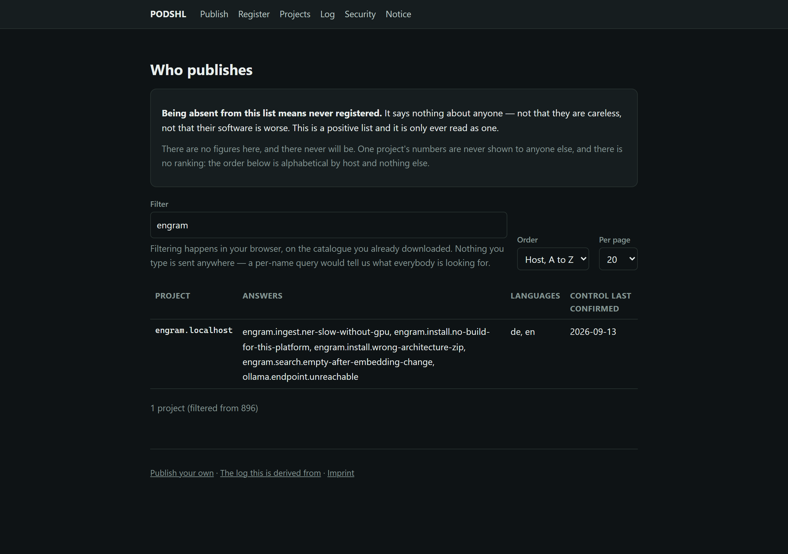

and its attestation is in the transparency log, which anybody can check without
asking us:

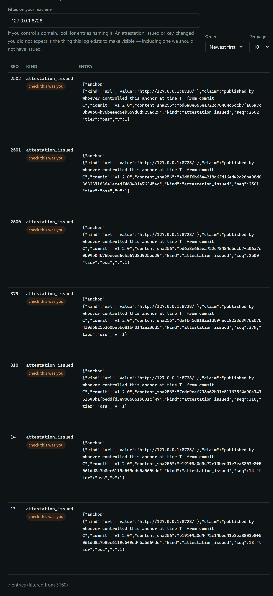

---

## And a diagnosis, which nobody authored

engram's five solutions become five decision trees at ingest, derived from the
`answers.when` blocks above. Asked over HTTP, with nothing written by hand:

```
POST /diagnose  {"problem_class": "engram.install.no-build-for-this-platform",
                 "facts": {"os.arch": "x86_64", "os.name": "macos"}}
  -> finding    no-build-for-intel-mac       confidence: measured

POST /diagnose  {... "facts": {"os.arch": "x86_64"}}
  -> need       os.name    read: {op: os_fact, name: os}
                "Two answers look alike here. os.name separates them."

POST /diagnose  {... "facts": {"os.arch": "x86_64", "os.name": "linux"}}
  -> no_statement   "no branch matches os.name='linux'"

POST /diagnose  {"problem_class": "engram.search.empty-after-embedding-change",
                 "facts": {"engram.symptom": "search returns nothing…"},
                 "stated": ["engram.symptom"]}
  -> finding    confidence: rests_on_supplied
                "this answer turned on engram.symptom, which the person supplied
                 rather than the machine reading. If it is wrong, that may be the
                 answer rather than the rule"
```

Four things worth noticing. The `need` carries a **real** probe — `os_fact os` —
so the client knows how to satisfy it without asking a person. The Linux case
answers *nothing* rather than the nearest branch. The last one is graded
differently because the fact was typed rather than read, which is the difference
between a defect in engram's rule and somebody who answered wrong. And declining
the question still answers, because that class has one solution and only a
question decides it — "I would rather not say" is not a dead end.

---

## What comes back

Thirty-three reports from thirty-three pseudonyms, posted through the same
`POST /report` a client uses. Five constellations, and one that stays hidden:

```
shown   6 reporters — Intel Mac — there is no build at all
shown   7 reporters — ARM64 Linux — the x86_64 archive was downloaded
shown   5 reporters — Search went empty after the embedding model changed
shown   6 reporters — Ingest slow on a machine with no GPU — nothing is broken
shown   6 reporters — No model endpoint — chat and debate are the only things that fail
HIDDEN  3 reporters — fewer than 5 independent reporters — counted, not evaluated,
                      because a rare constellation is identifying
```

That last line is the product. A dashboard that showed it would be publishing a
combination rare enough to point at the person who reported it.

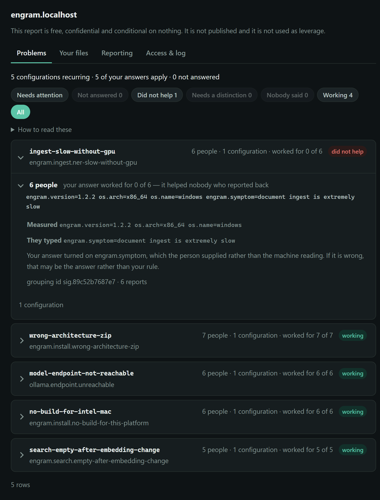

Each block reads as a sentence, and one of them says something engram's
maintainer could not have learned any other way:

```
engram.ingest.ner-slow-without-gpu
6 people — your answer worked for 0 of 6 who said. It helped nobody who reported back.
  Measured    engram.version=1.2.2  os.arch=x86_64  os.name=windows
  They typed  engram.symptom=document ingest is extremely slow
  Your answer: ingest-slow-without-gpu (low)
  It turned on engram.symptom, which the person supplied rather than the machine
  reading. If it is wrong, that may be the answer rather than your rule.
```

Six people were told their ingest is slow because they have no GPU, and it
helped none of them. That is either the wrong answer or the right answer badly
put — and the last line says which question to ask first, because the match
turned on what somebody typed rather than on anything measured.

Read the rest in the order the page puts it in:

* **What recurs.** Headed by the problem class the *maintainer* named, because
  that is the only human-readable identifier in the picture they chose. The
  derived `sig.…` is an identity for grouping and says nothing, so it sits at
  the bottom of the block in small type.
* **What answered it.** Nineteen of the reporters had **no model at all** and
  got the full path anyway, because matching is rule evaluation over closed
  vocabularies. That column is the whole argument for why a maintainer needs
  neither a model nor a server.
* **Facts people typed.** `engram.symptom` arrived typed 33 times because no
  reading can answer it, and `ollama.host` six times because the environment
  variable was empty and the question caught it. An outcome that turned on one
  of these is not evidence about the rule. engram's version is no longer among
  them: it is read from engram, and travels as a measurement.
* **In their own words.** Two of the six in the Ollama cluster sent the lines
  Ollama logged — `model 'gemma4:e4b' not found, try pulling it first` — with
  the address, the user name and every time replaced on their machine before
  they agreed to send it.

---

## Reproducing it

The stack must be up (`docker compose -f compose.yaml -f compose.gpu.yaml up -d`),
and everything below runs **inside the container**, where the checkout is
mounted at `/app` — the harness has `/app/src` and `/app/var/engram` written
into it. The files the static host serves are read from `var/engram/.podshl`,
which does not exist until you copy it there:

```bash
docker compose -f compose.yaml -f compose.gpu.yaml exec podshl bash
cd /app/examples/engram
mkdir -p /app/var/engram && cp -r .podshl /app/var/engram/

# 1. start the claim. It prints the digest to publish, and waits.
python harness/enrol.py

# 2. in a second shell in the container, serve engram's .podshl/ with that
#    digest — from harness/, because the module is `serve` in that directory
cd /app/examples/engram/harness
ENGRAM_CHALLENGE_TOKEN=<the digest it printed> \
  python -m uvicorn serve:app --host 0.0.0.0 --port 8728
#    then press Return in the first shell: it verifies, enrols and crawls

# 3. the reports
python harness/reports.py

# 4. what the gate says to a bad file
python harness/refusals.py
```

`enrol.py` seeds the claim onto the anchor row rather than going through
`POST /claim/{host}`, and says why in its own docstring: that route mints
`https://{host}/`, and this host speaks plain HTTP on loopback. Everything after
that one line is the shipped path — the probe really fetches, `verify` really
checks the proof and issues the token, `POST /claim/{host}/source` really enrols
the mirror, and the scheduler really validates.

The claim being two halves is visible here: the digest goes in the file, the
preimage stays in the script, and verification needs both.

---

## What this exercise found

Four defects, none of which were visible in the code and all of which were
obvious once something ran:

1. **Any stranger could take over any project.** `POST /claim/{host}/verify` was
   unauthenticated and checked only that the challenge file was *there* — and
   maintainers are told to leave it published forever. Reading a public file was
   treated as being the person who published it. Fixed: a claim has two halves
   and only one of them is published. `SV86`.
2. **A read instruction could walk out of its granted root.** The root check is
   a prefix test on both sides, and a prefix test does not see `..`. `SV84`.
3. **A registry read was arbitrary code execution.** Both parameters were
   interpolated into a PowerShell command string, unescaped. The read no longer
   builds a command string at all.
4. **`/register` led nowhere.** It proved control and issued a token, and
   nothing ever asked where the files were — `INSERT INTO source` existed only
   in the test suite. `SV85`.

Numbers 1 and 4 are the two that would have met the first real maintainer.

A review pass over the same code found three more, each now with a case that
performs the attack rather than describing it:

5. **A name could answer twice.** The host was resolved to be validated and then
   resolved *again* to connect — the DNS-rebinding hole `fetch.py`'s own
   docstring forbids. `SV87` moves a resolver between two loopback servers and
   asserts which one received the request.
6. **A symlink was the other way out of a granted root.** The `..` ban closed one
   spelling; a link inside the root leaves nothing in the path to notice.
7. **A percent-encoded `..` passed both containment checks**, because one read
   raw text and the other compared raw text, while the host that serves it
   decodes. `SV88`.

## Watching it

Three screencasts, recorded from the running system — the user's walk, the
maintainer's pages and a sixty-second cut — are in [`videos/`](videos/).

## The second walk: through the window, as a user

The first walk stopped at the dashboard. The second went through the client's
own window, on Windows, driven over WebView2's DevTools protocol — DOM events
only, so nothing collides with whoever is at the keyboard — from "engram's chat
never answers" to the receipt, in English and in German.
[`scripts/walk/drive_window.mjs`](../../scripts/walk/drive_window.mjs) repeats it, with
[`harness/fixtures/ollama-server.log`](harness/fixtures/ollama-server.log) as
the log a user loads — synthetic, and full of the things the anonymiser has to
catch.

What the person sees, photographed by that walk on 2026-09-13 — every step is
in [`shots/client-en/`](shots/client-en/) and [`shots/client-de/`](shots/client-de/):

| | English | Deutsch |
|---|---|---|
| Every reading shown and chosen, item by item | 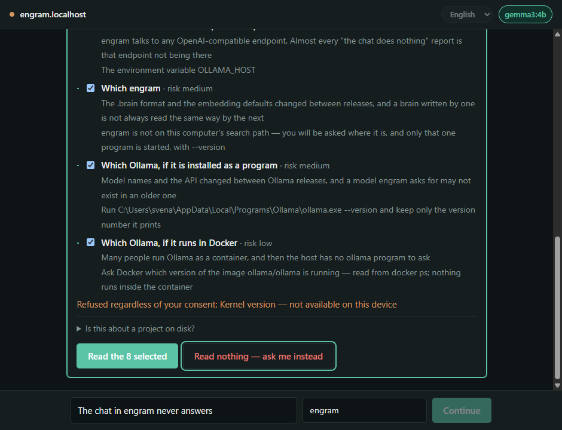 | 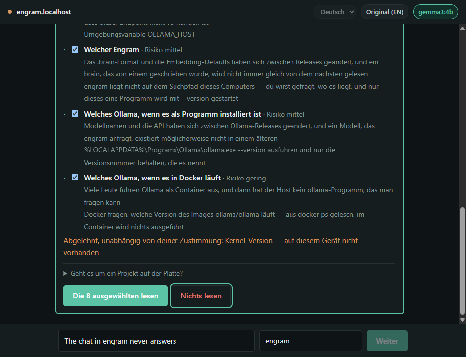 |
| engram is not on the search path, so the person is asked where it is | 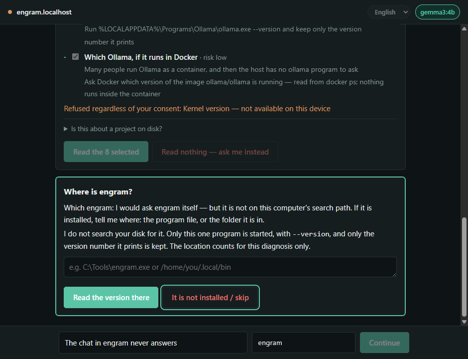 | 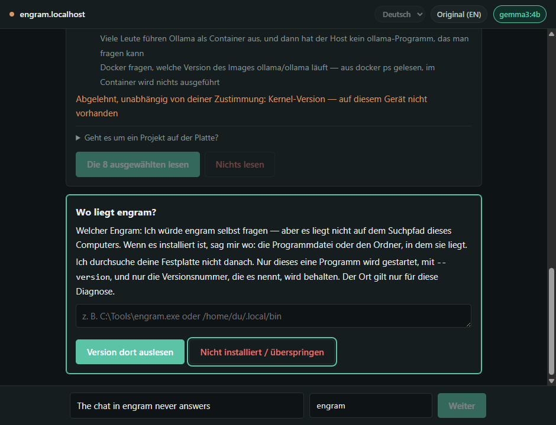 |
| The log, anonymised before anybody is asked to send it | 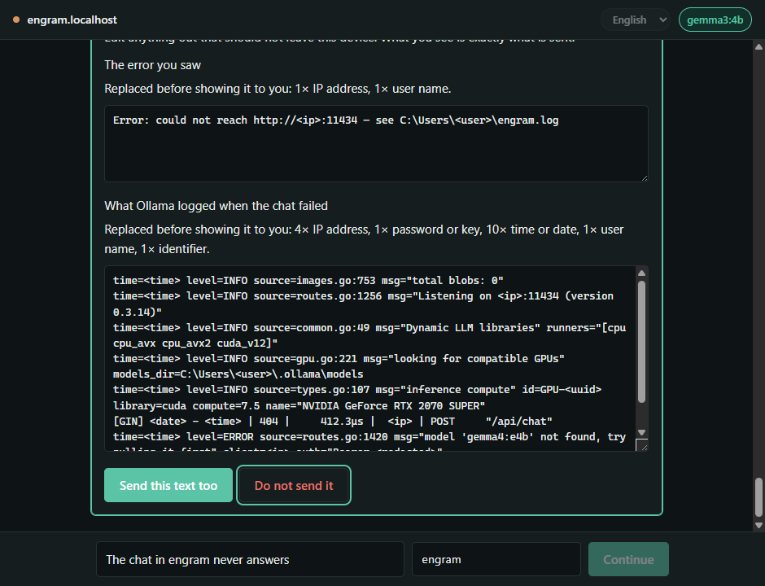 | 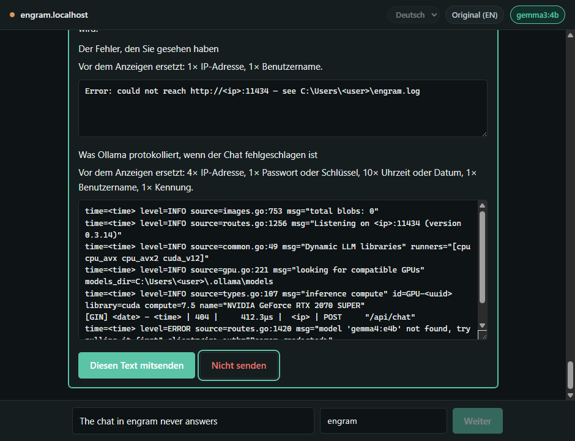 |
| engram's answer — in German translated by the reader's own model, with `engram reindex my.brain` and *brain* kept as engram wrote them | 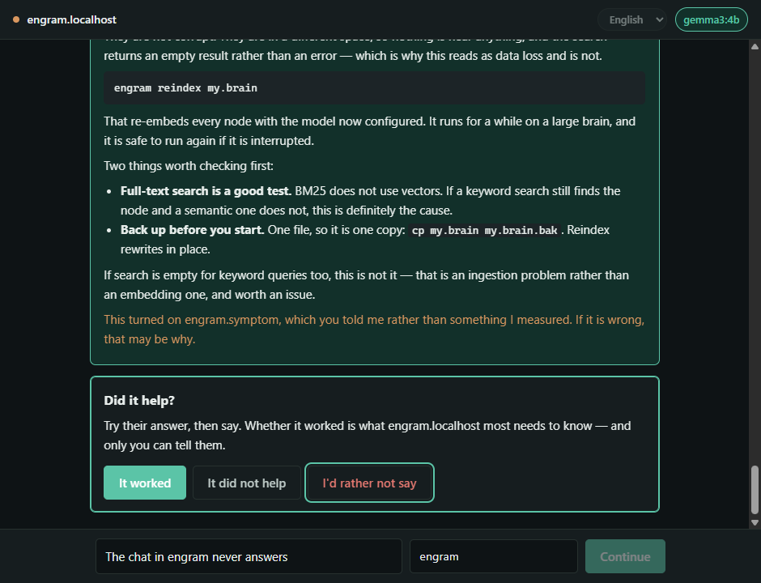 | 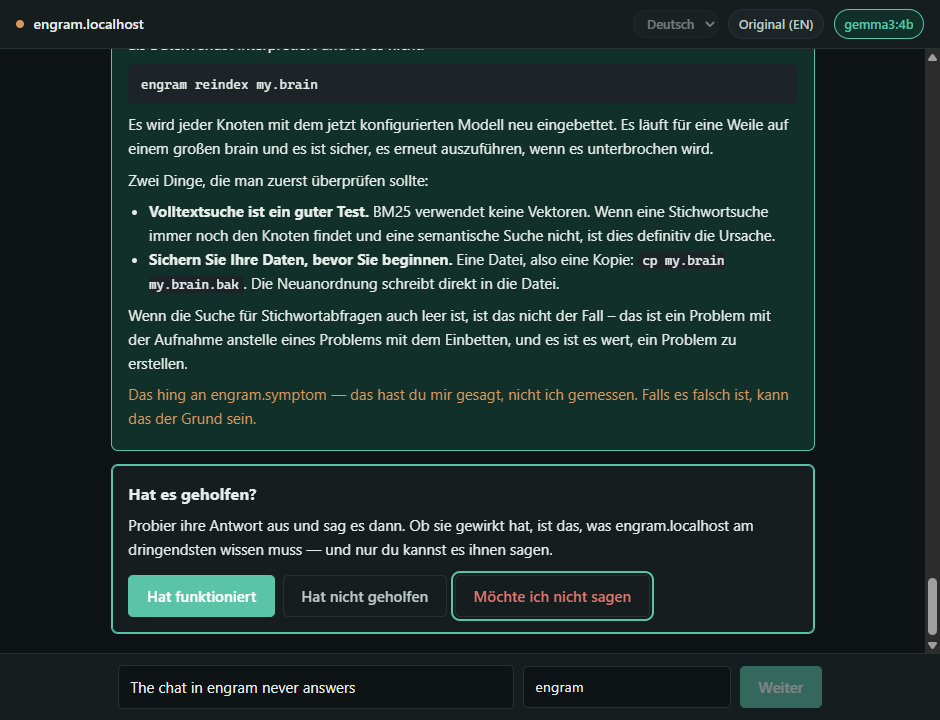 |

Every one of these was invisible to the suite, and most to reading the
code:

8. **The user was asked to type their engram version.** The manifest had no
   other way to get it. `program_version` asks engram; engram was not on the
   search path, so the window asked where it is, and read `1.2.2` from the
   folder the user named. `PV1`–`PV6`.
9. **The published path asked a person for facts a reading gives** — the tree's
   first `need`, `os.name`, went straight to a text box — and never read the
   project's own `collect` at all. `PB1`, `PB2`.
10. **Its report could not be delivered.** It went through the vendor path, A2A
    to an agent engram never ran, built from a skill the published path does not
    have. `PB3`.
11. **It reported `resolved` before anybody had tried the answer.** `PB4`.
12. **A question declared for a person was never asked, on either path, and a
    publisher's `choices` were never offered.** `PB5`.
13. **Every inline style in the window was blocked by its own CSP**, so every
    answer box past the first screen was 168 pixels wide. `W11`.
14. **The consent text was German on an English screen.** `I4`.
15. **The answer said "no Ollama running" to a machine running Ollama.** A
    reading that contradicted the only rule of a class landed on that rule's
    fallback. `SV95`.
16. **Running the test suite changed the user's reporting identity**, so one
    person reporting twice counted as two. Found because the receipt said "2
    independent people" after two runs on one machine.
17. **VRAM never travelled**, because `nvidia-smi` prints `8192 MiB` and the
    bucket rule wanted a number.
18. **A manifest asking for `.bash_history` passed the gate.** The refusal
    harness above printed "ACCEPTED (it should not have been)" and nobody had
    read that line.
